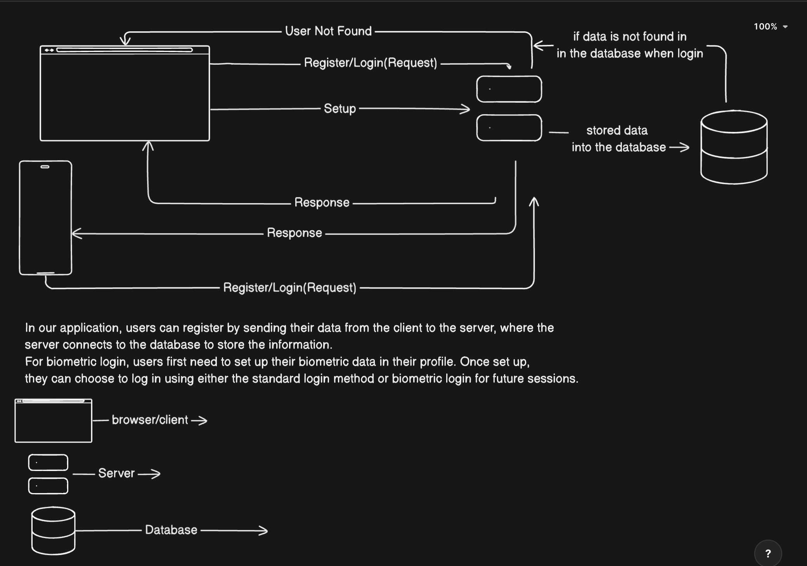

## Description

This is a simple project to demonstrate how to use Prisma with NestJS. This project is a simple API that authenticate user for registeration using standard login(email and password) or bio-metric login(finger print). The project is built with NestJS, Prisma, and Postgres.

## Diagram of the project


## Features
- User registration
- User login
- Setting up user bio-metric. **NB: You will need to set up your bio-metric key before you can login using bio-metric**
- User bio-metric login

## Technologies
- NestJS
- Prisma
- Postgres
- Jest

## Project setup

```bash 
# Clone the project
$ git clone <project-url>
```

```bash
# Change directory to the project
$ cd <project-directory>
```

```bash
# Install dependencies
$ yarn install
```

## Environment setup

```bash
# Create a new .env file by copying the .env.example file
$ cp .env.example .env
```

```bash
# Add the following environment variables to the .env file
DATABASE_URL="postgresql://<username>:<password>@localhost:5432/<database-name
```

```bash
# Add the following environment variables to the .env file
JWT_SECRET
```

## Docker Setup for Database Postgres

```bash
# Run the following command to start the postgres database
$ docker-compose up -d
```

```bash
# Run the following command to stop the postgres database
$ docker-compose down
```

## Compile and run the project

```bash
# development
$ yarn run start

# watch mode
$ yarn run start:dev
```

## Database setup

```bash
# Generate a new database with prisma
$ npx prisma generate
```

```bash
# Create a new migration
$ npx prisma migrate dev --name init
```

## Postman collection setup

```bash
# Import the postman collection
$ <project-directory>/postman-collection.json
```

## API Documentation

```bash
# GraphQL API documentation
$ http://localhost:3000/graphql
```

## Test the API

```bash
# Register a new user using graphql
$ mutation {
  createUser(createUserInput: {
    email: "",
    password: ""
  }) {
    id
    email
    biometricKey
    createdAt
    updatedAt
  }
}
```

```bash

# Login a user using graphql
$ mutation {
  login(loginInput: {
    email: "",
    password: ""
  }) {
    accessToken
    user {
      id
      email
      biometricKey
      createdAt
      updatedAt
    }
  }
}
```

```bash

# Set up user bio-metric using graphql
$ mutation {
  setupBiometricKey(setupBiometricKey: { biometricKey: "sadfsdasd"
  }) {
    id
    email
    biometricKey
    createdAt
    updatedAt
  }
}
```

```bash

# Login a user using bio-metric using graphql
$ mutation {
  biometricLogin(biometricLogin: { biometricKey: "adasfaffd" }) {
    accessToken
    user {
      id
      email
    }
  }
}
```


## Run tests

```bash
# unit tests
$ yarn run test

# e2e tests
$ yarn run test:watch
